# SECR Grouping Tool
---
## 使用說明
#### 首先把要輸入的檔案存成csv檔(Excel另存新檔)
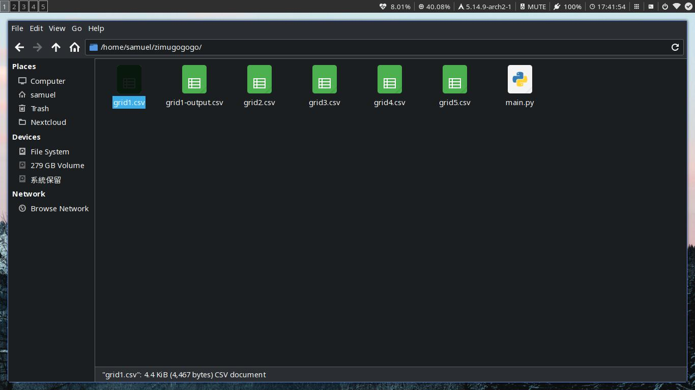
### 裡面的格式長這樣，注意欄位的值要固定
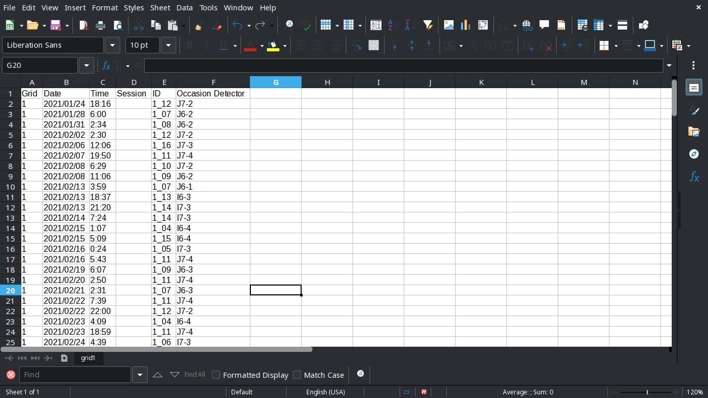
### 接著把整個資料教夾拖曳到vs code裡面
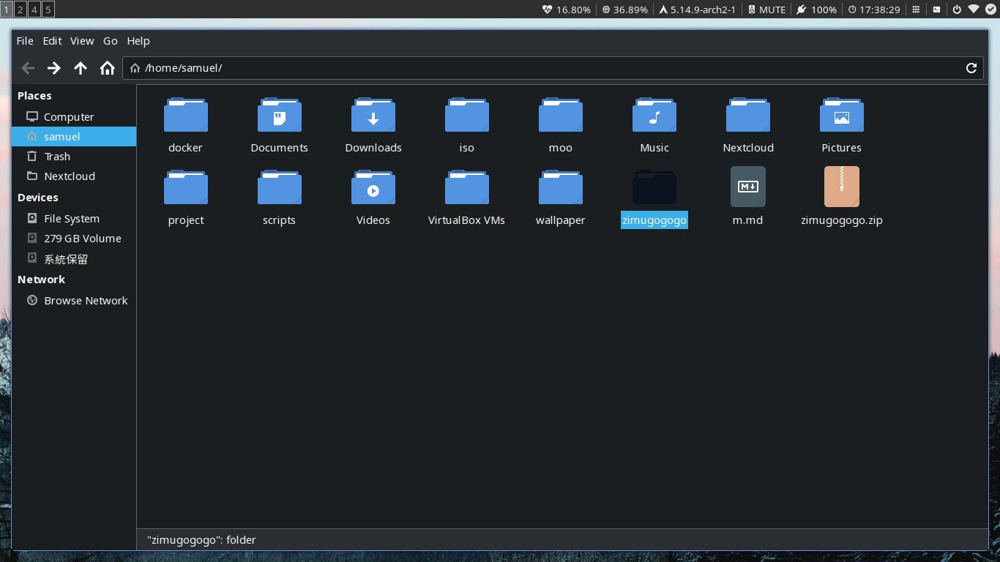
### explore這裡
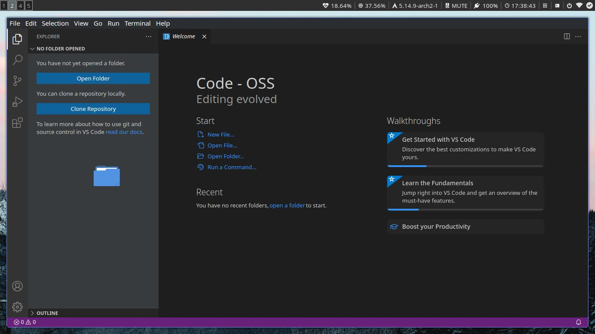
### 順利的話就會匯入ㄌ
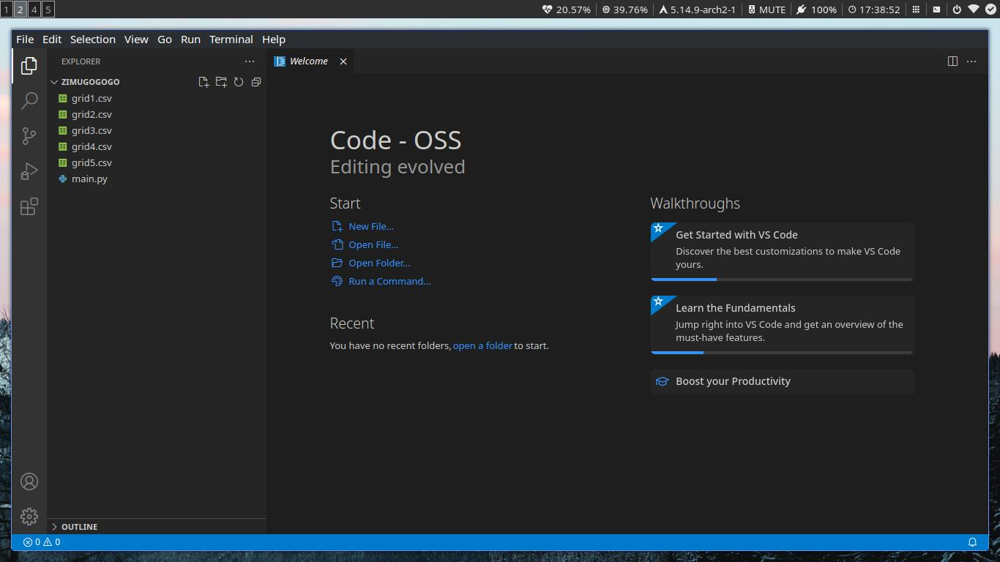
### `main.py`是主程式
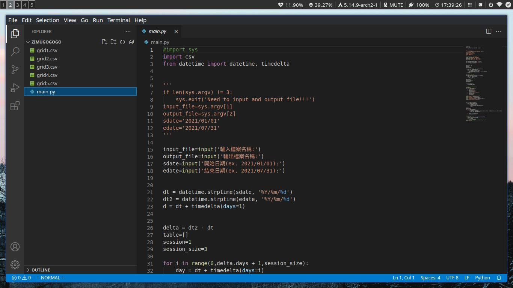
### 開啟一個`Terminal`(中文叫做`終端機`)
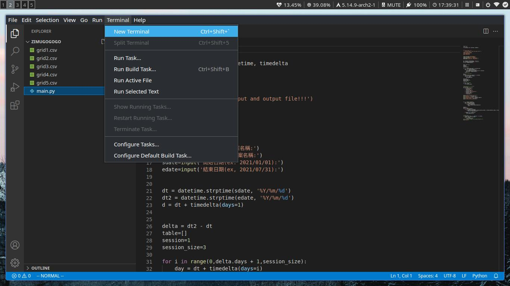
### 下面就會出現一個可以打指令的地方

### 然後輸入`python main.py`
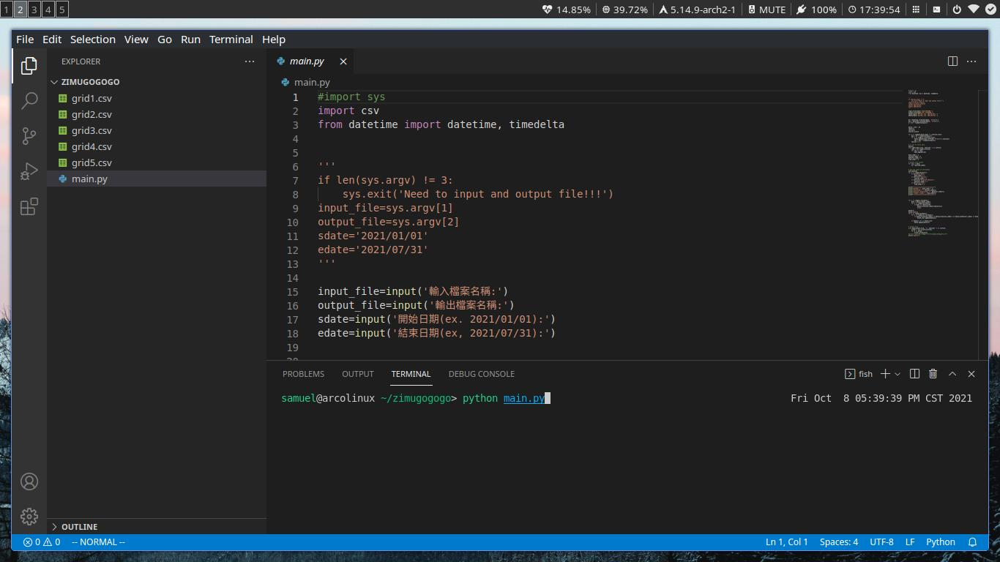
### 順利的話程式就會開啟，然後依序輸入`輸入檔名`、`輸出檔名`、`開始時間`、`結束時間`
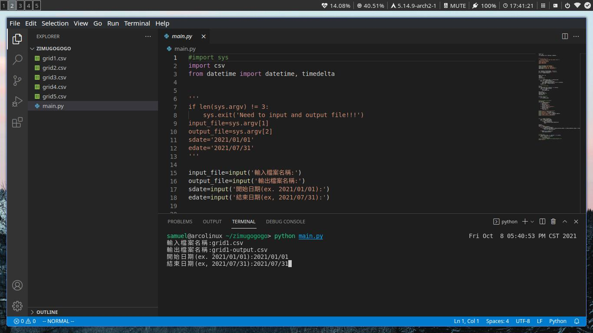
### 按下`Enter`，如果沒有錯誤訊息的話就表示成功了
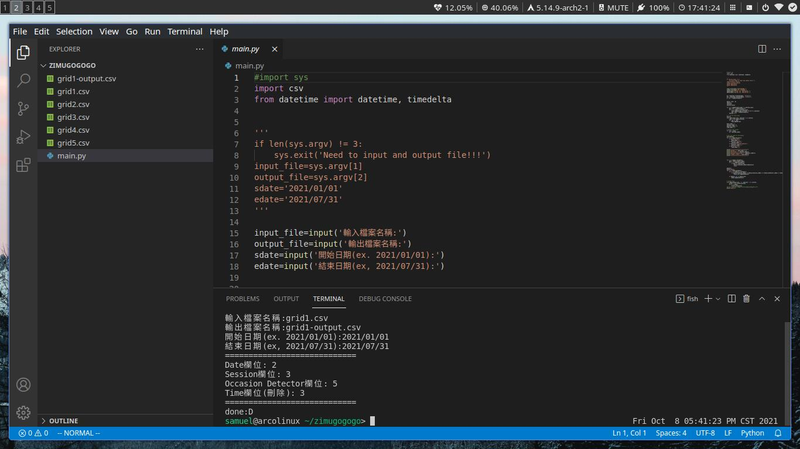
### 可以從左邊側欄查看檔案
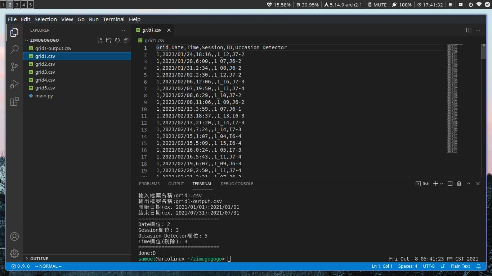
### 查看剛輸出的檔案
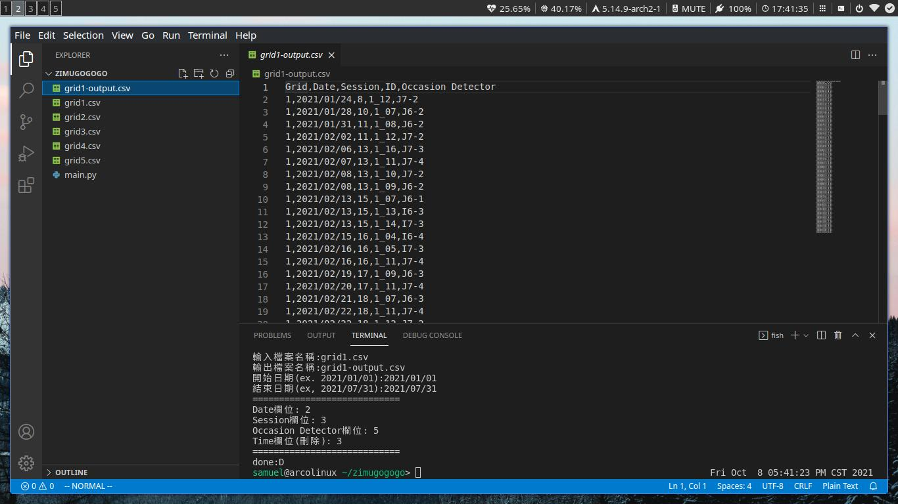
### 也可以回到資料夾中，用Excel開啟
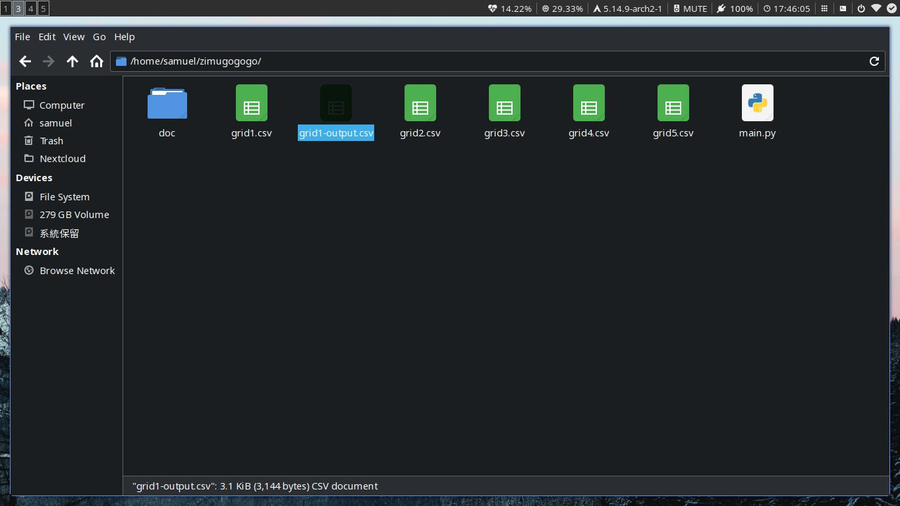
###	用Excel開啟後，再做後續要的處理 
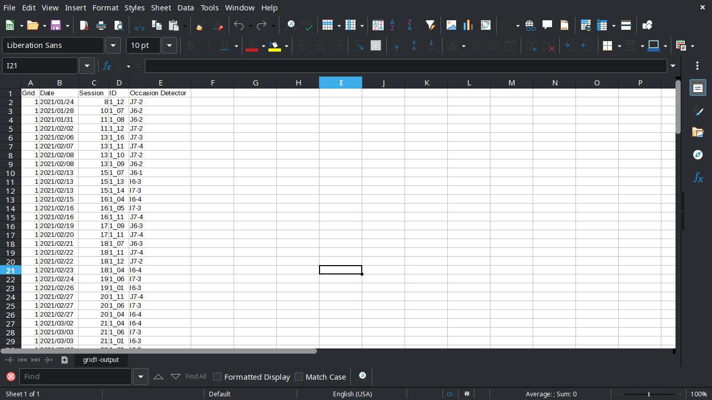
